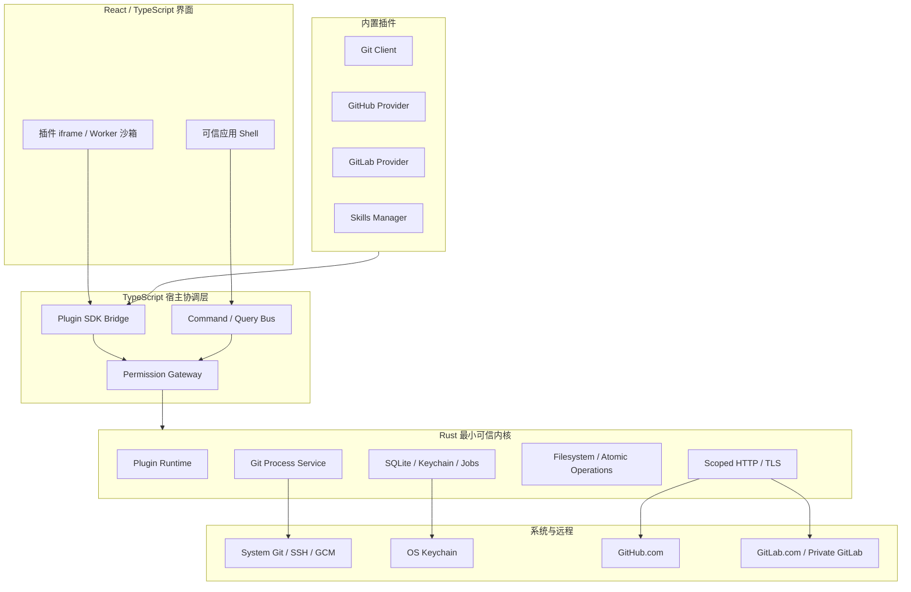

# Git-Ramus 跨平台 Git 与 Skills 管理工具设计

- 日期：2026-07-17
- 状态：书面审阅候选（会话内设计已确认）
- 范围：第一个公开 MVP 的产品、架构、安全和验收约束

## 1. 摘要

Git-Ramus 是一个支持 Windows、macOS 和 Linux 的可视化 Git 管理工具。它同时面向单仓库日常操作和多仓库管理，通过项目与工作区组织本地仓库，并通过 Provider 插件连接 GitHub.com、GitLab.com 和私有部署 GitLab。

应用采用 Tauri 2、React/TypeScript 和 Rust，实现“最小可信内核 + 功能插件”的微内核架构。Git Client、GitHub、GitLab 和 Skills Manager 都作为内置插件交付；第三方插件使用同一套 SDK、Manifest、生命周期和 UI 扩展点，但只能申请公开且受资源范围约束的能力。

首个业务插件是 Skills Manager。它管理 Agent Skills 的统一本地 Library，首版兼容 Codex 与 Claude Code，支持 Symlink 和 Copy、单 Skill 与多 Skill 仓库、Release 更新，以及创作者的校验、提交、推送、Tag 和 GitHub/GitLab Release 发布流程。

## 2. 目标

MVP 必须达到以下目标：

1. 提供完整的日常 Git 工作流：状态、Diff、暂存、提交、历史图、分支、合并、Fetch/Pull/Push、Remote、Tag、Stash 和基础冲突处理。
2. 提供全局多仓库概览，以及按根目录自动发现仓库的项目和跨目录组合项目的工作区。
3. 支持 GitHub.com、GitLab.com 和私有部署 GitLab；Git 传输复用系统 Git、SSH 和 Git Credential Manager，Provider API 使用受系统凭据库保护的 PAT。
4. 提供可由第三方使用的完整插件模型：导航、页面、命令、菜单、设置、后台任务和受控宿主能力。
5. 提供 Codex 与 Claude Code Skills 的安装、更新、回滚、卸载和创作者发布流程。
6. 提供可复用的 Git 身份档案、唯一全局身份和仓库级身份/认证切换。
7. 在失败、插件越权、恶意仓库、恶意归档和部分远程发布场景下保护用户数据与凭据。

## 3. 非目标

MVP 不包含：

- Pull Request、Merge Request、Issue 或代码托管平台管理后台。
- 插件市场、在线审核服务或公共评分系统。
- 内置 Skill Markdown 编辑器；创作者编辑通过外部编辑器完成。
- 交互式 Rebase、Cherry-pick、Reflog、Submodule 管理和 Git LFS 管理界面。
- 应用退出后仍运行的系统守护服务；后台任务仅在 Git-Ramus 运行时执行，并在下次启动时恢复可恢复任务。
- 跨网络文件系统的性能保证；本地磁盘是 MVP 的验收基线。
- 自动重写远程 Git 历史或自动删除已推送 Tag。

## 4. 术语

| 术语 | 定义 |
| --- | --- |
| 仓库 Repository | 一个实际 Git 仓库，包括普通仓库、Bare 仓库和 Worktree。 |
| 项目 Project | 用户打开的一个根目录；Git-Ramus 在其中递归发现一个或多个仓库。 |
| 工作区 Workspace | 用户命名的多个项目集合；项目可以位于不同磁盘和目录。 |
| Provider | GitHub、GitLab 或未来其他托管平台的插件适配器。 |
| Provider Instance | 一个具体托管实例，例如 `github.com`、`gitlab.com` 或企业 GitLab Base URL。 |
| 身份档案 Identity Profile | 可复用的提交名称、邮箱和签名设置。所有档案结构完全相同。 |
| Skill Source | 本地目录、Git 仓库或 Release 来源。 |
| Skill Package | 来源仓库中的一个 Skill 目录；多 Skill 仓库包含多个 Package。 |
| Skill Target | Codex 或 Claude Code 的用户级或项目级安装位置。 |

## 5. 已确认的关键决策

| 主题 | 决策 |
| --- | --- |
| 产品形态 | Windows、macOS、Linux 跨平台桌面应用。 |
| 技术栈 | Tauri 2 + React/TypeScript + Rust。 |
| Git 执行 | 系统 `git` CLI 为主执行引擎，不以 libgit2 为主。最低支持 Git 2.40。 |
| 架构 | 最小可信内核 + 内置/外部功能插件。 |
| 首批内置插件 | Git Client、GitHub Provider、GitLab Provider、Skills Manager。 |
| GitLab | 同时支持 GitLab.com 和可配置 Base URL 的私有部署。 |
| Git 认证 | 复用 SSH/GCM；Provider API 使用 PAT。 |
| Skills 客户端 | 首版支持 Codex 和 Claude Code。 |
| Skill 安装 | 所有 Skill 先进入 Git-Ramus Library；默认 Symlink，失败回退 Copy。 |
| Skill 更新 | 后台检查；默认用户确认；可为单个 Skill 开启自动更新。 |
| Skill 发布 | Commit/Push、SemVer Tag、GitHub/GitLab Release。 |
| 多 Skill 仓库 | 支持按 Skill 独立发布和整仓统一发布，由仓库配置决定。 |
| 创作者编辑 | 导入、校验、Git 与发布由插件完成；内容编辑打开外部编辑器。 |
| 身份 | 统一身份档案；一个唯一全局档案；仓库可绑定其他档案。 |

## 6. 总体架构



### 6.1 不可插件化的最小内核

以下功能必须留在宿主中，以避免启动、安全和恢复出现循环依赖：

- 应用启动、Tauri 窗口、基础导航容器、应用更新和崩溃恢复。
- 插件发现、Manifest 校验、签名/校验和、依赖解析、沙箱加载、启停、升级和回滚。
- 权限裁决、资源范围校验、速率限制和审计。
- SQLite 连接与根迁移、系统凭据库、任务调度、事件总线和日志。
- Git 进程启动、受控 HTTP、原子文件操作和安全归档解压。

### 6.2 插件化的业务功能

以下功能由插件贡献：

- 导航入口、路由、页面、命令、右键菜单、设置、状态徽标和通知。
- Git Client 的概览、项目、工作区和仓库功能。
- GitHub 与 GitLab Provider。
- Skills Manager。
- 后台检查、发布器、验证器和未来 Provider。

## 7. 插件模型

### 7.1 内置与外部插件

内置和外部插件使用相同的：

- SDK 类型和 RPC Schema。
- Manifest 格式。
- 安装、激活、停用、升级和卸载生命周期。
- UI 与 Domain Contribution Points。
- 任务、事件和错误模型。

差异仅包括：

- 内置插件随应用签名，可申请少量只向签名内置插件开放的系统能力。
- 外部插件可从本地目录、Git URL 或 Release 安装，必须显示来源、版本和校验和，并由用户批准权限。
- 未签名外部插件允许安装，但必须展示不可忽略的“发布者未验证”提示。

### 7.2 插件 Manifest

Manifest 至少包含：

- `id`、`name`、`version`、`publisher`、`description`。
- `sdkVersion`。
- UI 与后台入口点。
- `contributions`：导航、路由、命令、菜单、设置、Provider、验证器等。
- `permissions`：能力和资源范围。
- 可选插件依赖与版本范围。
- 发布校验和与可选签名信息。

### 7.3 公开能力

首版公共能力族包括：

- `ui.*`：页面、导航、命令、菜单、通知和对话框。
- `git.read.*` 与 `git.write.*`：只接受结构化参数和仓库 ID。
- `repositories.*`：读取已授权仓库、项目和工作区元数据。
- `fs.*`：只访问用户授予的目录句柄或插件私有目录。
- `storage.*`：插件命名空间存储；外部插件不能执行原始 SQL。
- `secrets.*`：只返回不可导出的 Secret Handle。
- `http.*`：只访问 Manifest 和用户批准的域名。
- `providers.*`：使用已授权 Provider Instance 和 Account。
- `tasks.*`：创建、取消和恢复后台任务。
- `events.*`：类型化事件订阅。

插件升级新增权限时，旧授权不自动扩大；用户必须重新批准。

### 7.4 沙箱

- 每个插件使用独立来源的 sandboxed iframe；后台代码运行于隔离 Worker。
- 插件默认没有 Tauri、Node、文件系统、Shell 或网络访问。
- 插件通过 `postMessage` 风格的类型化 RPC 访问宿主。
- 宿主校验调用者身份、Schema、API 版本、资源范围和调用频率。
- 插件崩溃只重启其沙箱，不终止应用。

## 8. Provider 架构

GitHub 与 GitLab 是独立内置 Provider 插件。Skills Manager 和其他插件只依赖 Provider Contract，不导入具体实现。

Provider Contract 至少提供：

- `validateInstance(baseUrl)`。
- `detectRemote(remoteUrl)`。
- `listRepositories(account, pagination)`。
- `getRepository(identity)`。
- `getLatestRelease(repository, filter)`。
- `createRelease(repository, tag, metadata, assets)`。
- `resolveSourceArchive(repository, tagOrCommit)`。
- Rate Limit、Retry-After 和权限范围信息。

GitLab Provider：

- 支持 `gitlab.com` 与任意 HTTPS Base URL。
- 使用系统证书库，并允许为实例配置额外 CA 文件。
- MVP 不提供“跳过 TLS 验证”。

Provider PAT、OAuth Token 或密码只存 OS Keychain。SQLite 仅保存 `SecretRef`。

## 9. Git Client 插件

### 9.1 页面与导航

核心导航为：

- 概览。
- 项目。
- 工作区。
- Skills（插件入口）。
- 插件。
- 任务中心。
- 设置。

仓库详情包含：

- Changes、Diff、Stage/Unstage、Commit。
- History Graph。
- Branches 与 Merge。
- Fetch、Pull、Push 和 Remotes。
- Tags、Stash 和 Conflicts。

### 9.2 项目、工作区与概览

- 项目保存一个根目录、递归扫描规则和排除规则。
- 扫描识别普通仓库、Bare 仓库和 Worktree。
- 仓库按规范化真实路径去重；同一仓库可以被多个项目引用。
- 工作区是多个项目的命名集合，不移动真实目录。
- 全局概览覆盖所有已知仓库，可按项目、工作区、分支和状态过滤。
- 批量操作仅包含 Fetch、Pull 和 Push；逐仓库记录结果并只重试失败项。

### 9.3 Git 执行模型

- 所有 Git 命令使用参数数组启动，不经过 Shell 字符串拼接。
- 机器解析优先使用 `--porcelain=v2`、`-z` 和结构化格式参数。
- 同一仓库写操作串行；只读操作受控并发；不同仓库可并发。
- 每个进程支持进度、取消、超时和输出脱敏。
- 取消或异常退出后必须重新读取仓库真实状态。
- Hooks、过滤器、Textconv 和外部 Diff 按仓库信任策略处理。

## 10. Git 身份与认证

### 10.1 提交身份档案

所有 Identity Profile 使用相同结构：

- 档案名称。
- `user.name`。
- `user.email`。
- `gpg.format`：OpenPGP、SSH 或 X.509。
- `user.signingKey`。
- 默认签署 Commit/Tag 的策略。

应用设置保存唯一的 `globalIdentityProfileId`。完成首次配置后必须恰好有一个全局身份：

- 把另一个档案设为全局时，旧档案自动降为普通档案。
- 当前全局档案不能直接删除；必须先把全局角色转移。
- 设置全局档案时使用 `git config --global` 同步标准 Git Global 配置。
- 第一次运行时读取已有 Git Global 身份，创建一个结构相同的身份档案，并将唯一全局指针指向它。
- 外部修改 Global 配置时显示 Drift，并允许“更新档案”或“重新应用档案”。

仓库行为：

- 绑定普通档案时使用 `git config --local` 写入仓库配置。
- 未绑定且没有外部 Local 身份时自然继承 Global，不复制重复值。
- 检测到其他工具写入的 Local 身份时显示“仓库自定义”，并允许导入为档案。
- 恢复“跟随全局”时删除 Git-Ramus 管理的 Local 身份键。
- Commit 面板始终显示本次提交的 Name、Email 和签名状态。

### 10.2 Git 传输身份

传输身份与提交身份分开管理：

- SSH Profile 保存密钥路径和非敏感参数，并使用仓库级 `core.sshCommand` / `ssh.variant`。
- HTTPS Profile 使用 `credential.useHttpPath` 和 `credential.<url>.username` 区分凭据上下文。
- 密码、PAT 和 OAuth Token 由 GCM 或 OS Keychain 保存。
- Git 原生 `core.sshCommand` 是仓库级设置；同一仓库需要多个 SSH 身份时使用 SSH Host Alias 和不同 Remote URL。
- Provider API Account 可以按 Remote 单独绑定。

## 11. 核心数据模型

### 11.1 宿主内核

- `PluginInstallation`。
- `PermissionGrant`。
- `Job` 与 `OperationStep`。
- `SecretRef`。
- `TrustedRepository`。
- `GlobalSettings`，包括 `globalIdentityProfileId`。

### 11.2 Git Client

- `Workspace` 与 `WorkspaceProject`。
- `Project` 与 `ProjectRepository`。
- `Repository`。
- `RepositorySnapshot`。
- `Remote`。
- `IdentityProfile` 与 `RepositoryIdentityBinding`。
- `TransportProfile` 与 `RepositoryAuthBinding`。

### 11.3 Provider

- `ProviderInstance`。
- `ProviderAccount`。
- `RemoteProviderBinding`。

### 11.4 Skills Manager

- `SkillSource`。
- `SkillPackage`。
- `SkillVersion`。
- `SkillTarget`。
- `SkillInstallation`。

关键关系：

- Workspace 与 Project 是多对多。
- Project 与 Repository 是多对多。
- Repository 有多个 Remote 和状态快照。
- Skill Source 有多个 Package；Package 有多个不可变 Version。
- Package 通过 Skill Installation 安装到多个 Target。

## 12. 持久化与目录布局

SQLite 使用 WAL 和迁移版本。内置插件通过声明式迁移维护自己的表前缀；外部插件只能使用宿主存储 API。

默认数据根目录使用操作系统应用数据目录。Skill Library 根目录可在设置中更改，但始终由 Git-Ramus 管理。

```text
<app-data>/
├── git-ramus.db
├── plugins/
│   └── <plugin-id>/<version>/
├── plugin-data/
│   └── <plugin-id>/
└── skill-library/
    ├── authoring/<source-id>/
    ├── versions/<package-id>/<version-or-commit>/
    ├── active/<package-id>/
    └── staging/<operation-id>/
```

- `authoring` 是创作者可编辑的 Git 工作副本。
- `versions` 是使用者安装的不可变物化版本。
- `active` 是稳定激活指针；客户端 Symlink 指向稳定位置。
- `staging` 用于下载、验证、解压和原子切换。

数据库迁移前创建可恢复备份。应用启动发现迁移失败时进入只读恢复模式。

## 13. Skills Manager 插件

### 13.1 标准与客户端适配器

公共验证遵循 Agent Skills 规范：Skill 是包含 `SKILL.md` 的目录，必须有 `name` 和 `description`，并可包含 scripts、references、assets 等资源。

客户端差异由 Adapter 隔离：

- Codex：发现当前官方 `.agents/skills` 用户级/项目级目录，并兼容检测安装环境使用的 `$CODEX_HOME/skills` 路径。
- Claude Code：发现 `~/.claude/skills` 与项目 `.claude/skills`。
- Adapter 提供 Target 发现、兼容字段诊断、Symlink 能力探测和刷新提示。

### 13.2 安装与更新

- 所有 Skill 先进入统一 Library，再安装到客户端 Target。
- 默认创建目录 Symlink；权限、文件系统或客户端限制导致失败时自动回退 Copy，并记录实际模式。
- Copy 更新使用临时目录和原子替换。
- 来源支持本地目录、Git URL 和 GitHub/GitLab Release。
- 支持单 Skill 仓库和多 Skill 集合仓库，通过仓库内路径区分 Package。
- 后台自动检查 Release；默认由用户确认更新；单个 Skill 可开启自动更新。
- 更新先下载到 Staging，完成公共规范和客户端兼容校验后物化为不可变版本，再原子切换 Active。
- 任一 Target 安装失败时恢复旧 Active 与旧 Copy。

### 13.3 仓库配置与版本策略

普通仓库无需 Git-Ramus 配置即可扫描和安装。多包发布策略使用可选文件：

```json
{
  "schemaVersion": 1,
  "releaseMode": "per-skill",
  "packages": [
    { "path": "skills/pdf", "tagPrefix": "pdf/" }
  ]
}
```

文件路径为 `.git-ramus/skills.json`。

支持两种模式：

- `per-skill`：每个 Skill 独立 SemVer，Tag 形如 `<skill-name>/v1.2.3`。
- `repository`：整个仓库统一 SemVer，Tag 形如 `v1.2.3`。

由 Git-Ramus 创建的 Release 包含：

- Source ZIP 或 Package ZIP。
- `git-ramus-release.json`。
- SHA-256 校验信息。

非 Git-Ramus Release 仍可通过 Tag Source Archive 与仓库内路径安装，但界面显示较低的发布元数据完整度。

### 13.4 创作者流程

首版创作者模式提供：

- 把已有目录导入 `authoring`。
- Agent Skills 公共规范和 Codex/Claude 兼容诊断。
- 使用外部编辑器打开工作副本。
- Git 状态、变更预览、Commit 和 Push。
- 选择 Package 或 Repository 发布范围。
- 创建并 Push SemVer Tag。
- 通过 Provider 创建 Release 和上传资产。

如果 Tag 已推送但 Release 失败，任务记录“部分发布”恢复点，重新执行时先对账并继续剩余步骤，不自动删除 Tag。

## 14. 关键操作流程

### 14.1 打开项目

1. 用户选择根目录。
2. 读取扫描深度和排除规则。
3. 递归识别仓库并规范化路径。
4. Upsert Project/Repository 关系。
5. 受控并发读取仓库状态。
6. 概览按仓库渐进更新，不等待全部完成。

### 14.2 Git 写操作

1. 插件通过结构化 Git API 发出命令。
2. 宿主校验权限、仓库信任和前置状态。
3. 获取仓库写锁。
4. 启动系统 Git 并流式报告进度。
5. 完成、取消或失败后重新读取真实状态。
6. 写入 Job 结果和审计信息。

### 14.3 批量同步

- 每个仓库是独立原子边界。
- 并发受全局上限控制。
- 不承诺跨仓库回滚。
- 任务中心显示成功、失败和跳过项，并允许只重试失败项。

### 14.4 身份切换

1. 读取有效配置及 System/Global/Local 来源。
2. 验证邮箱、签名工具、密钥和传输设置。
3. 快照将修改的配置键。
4. 使用 `git config --local` 或 `--global` 写入。
5. 回读并执行可选连接/签名测试。
6. 成功后更新绑定或全局指针；失败恢复旧配置。

### 14.5 插件安装或升级

1. 下载或复制到 Staging。
2. 校验 Manifest、来源、校验和、SDK 兼容和签名。
3. 展示新增权限并取得批准。
4. 启动新版本健康检查。
5. 原子切换激活版本。
6. 启动失败时隔离新版本并恢复旧版本。

## 15. 错误处理与恢复

统一错误对象包含：

- `code`。
- `operationId` 与 `pluginId`。
- 资源 ID。
- 失败步骤。
- 面向用户的消息与已脱敏详情。
- 可重试性、`retryAfter` 和可执行恢复动作。

错误类别：

- `Validation`：就地修正，不创建后台任务。
- `UserActionRequired`：登录、信任、权限或冲突处理，任务暂停并保留上下文。
- `Retryable`：网络超时、限流、临时锁；只对幂等读取自动退避重试。
- `PartialResult`：批量 Git 或发布部分完成；逐项展示并对账。
- `InternalFatal`：隔离插件或进入只读恢复模式，允许导出脱敏诊断。

恢复原则：

| 操作 | 恢复策略 |
| --- | --- |
| 扫描/Status | 保留旧快照并重试。 |
| 批量 Git | 逐仓库重试。 |
| Commit/Merge | 刷新 Git 状态并进入冲突/继续流程。 |
| Skill 安装更新 | 自动恢复旧 Active 和 Copy。 |
| 插件升级 | 自动恢复旧插件版本。 |
| 身份切换 | 恢复配置键快照和绑定。 |
| Tag/Release | 对账远程状态并继续剩余步骤。 |
| 数据库迁移 | 事务回滚和迁移前备份。 |

## 16. 安全设计

### 16.1 仓库信任

- 新路径先以受限只读模式打开。
- 未信任仓库不运行 Hooks、外部 Diff、Textconv 或插件内容访问。
- 提交、切换、合并等可能运行仓库代码的操作要求信任。
- 首次发现 Hooks 时在信任详情中显示。

### 16.2 Skill 信任

- 安装前展示来源、Commit/Tag、校验状态、scripts 和可执行文件清单。
- 解压必须防止 Zip Slip、Symlink Escape、重复路径和超额解压。
- Git-Ramus 只保证安装过程的边界；Codex/Claude 后续执行 Skill 的安全由相应客户端策略决定。

### 16.3 凭据与日志

- 插件永远拿不到 PAT、密码或私钥明文。
- 所有敏感值只存 OS Keychain 或外部凭据助手。
- 日志、错误、诊断和 RPC 统一脱敏。
- 诊断导出默认移除 Token、用户名、邮箱和敏感路径，并要求用户预览。

## 17. 测试策略

### 17.1 测试层次

- Rust/TypeScript 单元、属性和模糊测试：解析器、路径、权限、版本和事务。
- 契约与组件测试：Plugin SDK、Provider、Git Engine、Skill Client Adapter 和 React 页面。
- 集成测试：真实 Git CLI、临时仓库、SQLite、模拟 Provider HTTP 和 Keychain Mock。
- 桌面 E2E：WebdriverIO + Tauri，覆盖真实 WebView 和 IPC。

Tauri 当前官方测试路线支持 Mock Runtime、浏览器模式和 WebDriverIO 桌面 E2E。

### 17.2 平台矩阵

| 维度 | MVP 验收范围 |
| --- | --- |
| Windows | Windows 11 x64 必测；ARM64 构建冒烟。 |
| macOS | 发布时当前与前一主版本；Apple Silicon 必测，Intel 构建冒烟。 |
| Linux | 发布时当前与前一 Ubuntu LTS x64；其他发行版 best effort。 |
| Git | Git 2.40 与发布时当前稳定版。 |
| GitLab | GitLab.com；私有 GitLab 当前与前一主版本。 |
| Skills | Codex/Claude，用户级/项目级，Symlink/Copy，三平台。 |

### 17.3 必须通过的用户旅程

1. 打开含多个嵌套仓库的项目，应用排除规则并构建跨目录工作区。
2. Diff、暂存、选择身份、签名提交、分支、合并、Stash、Tag 和冲突处理。
3. 多仓库 Fetch/Pull/Push，出现认证和冲突失败后只重试失败项。
4. 创建多个统一身份档案、转移唯一全局角色、仓库绑定和恢复继承，并由 CLI 回读验证。
5. 连接 GitHub、GitLab.com 和私有 GitLab，浏览/克隆仓库并创建 Release。
6. 安装第三方插件、批准/撤销权限、升级失败回滚和卸载。
7. 从单包/多包仓库安装 Skill 到 Codex/Claude，完成 Symlink/Copy、更新与回滚。
8. 创作者导入、外部编辑、双平台校验、Push、两种版本策略和部分发布恢复。

### 17.4 性能与发布门槛

- 参考机器冷启动至可操作不超过 2.5 秒；扫描不阻塞启动。
- 打开包含 100 个本地小仓库的项目后，1 秒内显示首批仓库。
- 本地 SSD 上 100 个小仓库的首轮状态汇总不超过 10 秒；慢仓库独立超时。
- 发布时不存在已知 Critical/High 安全漏洞、秘密泄漏或数据损坏缺陷。
- 每个 Pull Request 必须通过格式、Lint、类型、单元、契约、Git 集成和浏览器模式 UI 测试。
- Windows/Linux 真实 WebView E2E 在 PR 阶段运行；三平台 E2E 每日运行；发布候选执行真实 Provider 冒烟。

## 18. 实施拆分

该产品包含多个独立子系统，不应在一个巨型实现计划中同时编码。此主规格作为各阶段共享契约，实施按以下顺序进行：

1. **Foundation / Microkernel**：Tauri/React Shell、Rust IPC、SQLite/Keychain、任务中心、插件 Manifest、沙箱、权限网关和示例插件。
2. **Git Client Vertical Slice**：Git Engine、仓库详情基础、项目/工作区/概览、身份档案和首条 Commit 流程。
3. **Daily Git + Provider Plugins**：完整日常 Git、批量同步、GitHub Provider、GitLab Provider 和私有实例。
4. **Plugin Distribution Hardening**：本地/Git/Release 安装、更新回滚、后台任务和 SDK 契约套件。
5. **Skills Manager**：Library、客户端 Adapter、安装/更新/回滚和创作者发布。
6. **Release Hardening**：三平台打包、迁移、性能、安全测试、真实 Provider 验收和文档。

每个阶段在开始编码前获得独立的详细实施计划；阶段间通过本规格中的公共契约集成。第一个实施计划只覆盖 Foundation / Microkernel。

## 19. 参考资料

- [Tauri Architecture](https://v2.tauri.app/concept/architecture/)
- [Tauri Capabilities](https://v2.tauri.app/security/capabilities/)
- [Tauri Testing](https://v2.tauri.app/develop/tests/)
- [Git Configuration](https://git-scm.com/docs/git-config)
- [Agent Skills Specification](https://agentskills.io/specification)
- [OpenAI: Build Skills](https://learn.chatgpt.com/docs/build-skills)
- [Claude Code: Extend Claude with Skills](https://code.claude.com/docs/en/slash-commands)
