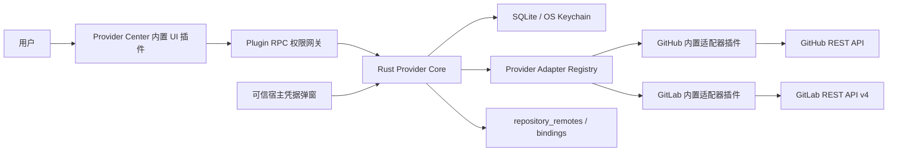

# Provider 账户与仓库发现纵向切片设计

- 日期：2026-07-19
- 状态：书面审阅候选（会话内设计已确认）
- 所属产品：Git-Ramus
- 范围：GitHub、GitLab.com 与自部署 GitLab 的 Provider 账户及仓库发现基础

## 1. 摘要

本纵向切片在现有 Git Client、插件沙箱、RPC 权限网关、SQLite 与系统密钥链基础上，交付第一个可使用的 Provider 能力：配置 GitHub 和 GitLab 实例、连接多个 PAT 账户、浏览账户可访问的仓库，并把远程仓库与现有本地 Git remote 关联。

采用“宿主 Provider Core + 内置 Provider 插件”架构。可信宿主负责安全 HTTP、TLS、自定义 CA、SecretRef、持久化、分页、限流和错误归一化；GitHub 与 GitLab 插件分别实现后端适配器并贡献类型化 Provider 描述；统一的 Provider Center 内置插件负责用户界面。插件 UI 不能读取已保存的 PAT。

本切片只建立 Provider API 和本地仓库之间的关系，不执行 Git 传输或 Release 操作。Clone、Fetch、Pull、Push 属于后续 Git 传输切片；Skills 所需的 Release 查询和发布属于后续 `ReleaseProvider` 切片。

## 2. 与总体设计的关系

本设计细化 `2026-07-17-git-ramus-design.md` 中的 Provider 架构，并采用接口隔离落实总体设计列出的能力：

- 本切片实现仓库发现接口：实例验证、账户认证、仓库列表、仓库详情和 remote 识别。
- 后续 Skills 发布切片实现独立的 `ReleaseProvider`：Release 查询、创建、资产上传和源归档解析。
- Git 传输继续使用系统 Git、SSH 和 Git Credential Manager，不把 Provider PAT 自动当作 Git 凭据。
- Provider API 账户、Git 传输账户和 Git 提交身份始终是三个独立概念。

## 3. 目标

1. 支持 GitHub.com、GitLab.com 和任意经过用户确认的 HTTPS 自部署 GitLab Base URL。
2. 同一 Provider 实例支持多个 PAT 账户，并允许设置一个实例默认账户。
3. PAT 仅由可信宿主短暂接收，持久化到 OS Keychain；SQLite 只保存 SecretRef。
4. 浏览、搜索、筛选和分页显示账户关联且 PAT 可访问的全部个人、组织/群组及私有仓库。
5. 将 Provider 仓库与已有本地 `repository_remotes` 自动匹配，提示用户确认，并支持手动修正。
6. 为后续 Git 传输、Release 和 Skills Manager 提供稳定的 Provider Contract 与绑定模型。
7. 让 Provider Center 完整使用宿主语义化设计令牌，以便 UI 风格插件统一改变其视觉表现。

## 4. 非目标

本切片不包含：

- Clone、Fetch、Pull、Push 或任何其他 Git 网络命令。
- Git SSH/GCM 传输账户的创建或切换。
- Release 查询、创建、资产上传或 Tag 操作。
- Skills 安装、更新或创作者发布。
- GitHub Enterprise Server；首版 GitHub 实例固定为 GitHub.com。
- OAuth、GitHub Device Flow、GitLab OAuth 或网页登录。
- 跳过 TLS 证书验证。
- 外部插件提供原生/后端 Provider 适配器。
- 把所有远程仓库永久镜像到本地数据库。

## 5. 已确认决策

| 主题 | 决策 |
| --- | --- |
| 认证 | GitHub 与 GitLab 首版均使用 PAT。 |
| 多账户 | 同一实例允许多个账户、一个默认账户和 remote 级显式绑定。 |
| 发现范围 | 显示账户关联且 PAT 可访问的全部个人、组织/群组及私有仓库。 |
| 本地关联 | URL 唯一匹配后给出建议，由用户确认；歧义必须手动处理。 |
| 业务边界 | 本切片不包含 Git 传输和 Release。 |
| 架构 | 可信宿主 Provider Core + GitHub/GitLab 内置适配器插件。 |
| UI 组合 | 统一 Provider Center；Provider 插件只贡献类型化描述和能力。 |
| 凭据输入 | 使用 iframe 外的可信宿主凭据弹窗，不通过插件 RPC 传递 PAT。 |
| GitLab TLS | 系统证书库 + 可选实例级额外 CA，始终验证证书。 |
| 外部插件 | 可经用户授权读取脱敏 Provider 数据；首版不能管理账户或注册后端适配器。 |

本设计中的“全部可访问仓库”是指认证账户拥有、协作或通过组织/群组成员关系获得访问权的仓库集合，不是把互联网上与该账户无关的所有公开仓库纳入结果。

## 6. 总体架构



### 6.1 Provider Core

Provider Core 是不可由外部插件替换的可信宿主基础设施，负责：

- Provider 实例、账户摘要和 remote 绑定的事务持久化。
- SecretRef 与系统密钥链的安全交换。
- 按实例构建受限 HTTP Client。
- 系统证书库、额外 CA、超时、响应体和并发上限。
- 分页 Cursor、Rate Limit 和 Retry-After 归一化。
- URL 规范化、同源检查和稳定错误映射。
- Provider Adapter 的注册、启用状态和调用隔离。
- RPC DTO 脱敏与诊断日志脱敏。

### 6.2 内置 Provider 插件

GitHub 与 GitLab 是独立的内置插件包，并各自包含：

- 编译进可信宿主的 Adapter 实现。
- Provider 类型化 Contribution。
- API 响应到统一 DTO 的映射。
- Provider 特有的认证头、分页、限流和能力识别。

Adapter 只有在对应内置插件处于启用状态时才能被调用。禁用插件不会删除实例、账户摘要、SecretRef 或 remote 绑定；Provider Center 将这些记录显示为“Provider 已禁用”。

### 6.3 Provider Center

Provider Center 自身是一个内置 UI 插件，贡献唯一的 Provider 导航入口。它通过公开 RPC 使用 Provider Core，不直接导入 GitHub 或 GitLab 实现，也不嵌入 Provider 插件提供的任意 DOM。

所有布局和状态都使用宿主定义的语义化设计令牌。主题/UI 风格插件可以改变配色、字体、密度、圆角和其他令牌，但不能绕过 Provider RPC 或替换可信凭据弹窗。

## 7. 插件 Manifest 扩展

`contributions` 增加可选的 `providers` 数组。单个贡献至少包含：

```ts
interface ProviderContribution {
  providerId: "github" | "gitlab";
  adapterId: string;
  displayName: string;
  icon: string;
  instanceModes: Array<"cloud" | "selfHosted">;
  capabilities: Array<"repositoryDiscovery" | "customCa">;
}
```

约束：

- 首版只有 `kind: "builtin"` 的签名插件可以声明 `contributions.providers`。
- `adapterId` 必须与宿主编译时注册表中的插件 ID 和 Provider ID 匹配。
- 同一 `providerId` 只能有一个已启用的内置 Adapter。
- Provider 后端插件可以没有 UI 入口；Manifest 必须至少包含一个有效入口或受支持的 Contribution。
- 现有 UI 插件 Manifest 保持兼容；新增字段是可选字段。
- 外部 Provider 后端 SDK、签名和进程隔离不属于本切片。

## 8. 持久化模型

本切片新增 SQLite migration `0003_provider_discovery.sql`，完成后设置 `PRAGMA user_version = 3`。迁移必须在单一事务内执行。

### 8.1 `provider_instances`

| 字段 | 约束与含义 |
| --- | --- |
| `id` | UUID 文本主键。 |
| `provider_kind` | `github` 或 `gitlab`。 |
| `display_name` | 用户可识别名称。 |
| `base_url` | 规范化 Web Base URL。 |
| `api_base_url` | 由 Adapter 推导并验证的 API Base URL。 |
| `custom_ca_path` | 可空；用户选择的额外 CA 文件规范化路径。 |
| `last_validated_at` | 可空；最近成功验证时间。 |
| `server_version` | 可空；Provider 返回的非敏感版本摘要。 |
| `created_at` / `updated_at` | UTC 时间。 |

约束：

- `(provider_kind, base_url)` 唯一。
- GitHub 仅允许固定 Web/API 地址。
- GitLab Base URL 必须为 HTTPS，可包含自部署实例的相对根路径，但不能包含用户名、密码、查询参数或片段。
- `api_base_url` 不能由插件调用时覆盖。

### 8.2 `provider_accounts`

| 字段 | 约束与含义 |
| --- | --- |
| `id` | UUID 文本主键。 |
| `instance_id` | 外键到 `provider_instances`，删除受限。 |
| `provider_user_id` | Provider 返回的稳定用户 ID，作为字符串保存。 |
| `username` | 当前用户名摘要。 |
| `display_name` | 可空。 |
| `avatar_url` | 可空。 |
| `secret_ref` | 随机且不含用户名/实例地址的密钥引用。 |
| `is_default` | `0` 或 `1`。 |
| `last_validated_at` | 最近成功认证时间。 |
| `created_at` / `updated_at` | UTC 时间。 |

约束：

- `(instance_id, provider_user_id)` 唯一；同一用户的新 PAT 走轮换流程。
- 使用部分唯一索引保证每个实例最多一个 `is_default = 1` 的账户。
- Provider 的整数 ID 以字符串跨 Rust/TypeScript 边界，避免 JavaScript 精度问题。
- `secret_ref` 唯一，但不通过 Provider 插件 RPC 返回。
- 删除仍被显式绑定的账户时使用 `ON DELETE RESTRICT`。

### 8.3 `provider_repository_bindings`

| 字段 | 约束与含义 |
| --- | --- |
| `repository_id` | 本地仓库 ID。 |
| `remote_name` | 本地 Git remote 名称。 |
| `provider_instance_id` | 绑定实例。 |
| `provider_account_id` | 可空；为空表示继承实例默认账户。 |
| `provider_repository_id` | Provider 稳定仓库 ID，字符串。 |
| `full_name` | 绑定时的 namespace/name 快照。 |
| `web_url` | 绑定时的浏览地址快照。 |
| `matched_url` | 触发或确认绑定的已脱敏 remote URL。 |
| `binding_source` | `auto` 或 `manual`。 |
| `bound_at` / `updated_at` | UTC 时间。 |

约束：

- 主键为 `(repository_id, remote_name)`。
- 复合外键指向现有 `repository_remotes(repository_id, name)`，remote 删除时级联删除绑定。
- `provider_instance_id` 删除受限。
- 非空 `provider_account_id` 必须属于同一个 `provider_instance_id`，通过复合外键或等价事务校验保证。
- `binding_source = auto` 表示用户接受了自动匹配建议，不表示应用曾静默创建绑定。
- Remote 的 fetch/push 指向不同仓库时不自动绑定；界面显示歧义并要求用户选择该 remote 的主要 Provider 仓库。绑定不改变实际 fetch/push URL。

### 8.4 远程仓库列表

远程仓库页面按需请求，不建立完整仓库缓存表。只有已经建立的绑定保存必要快照，因此：

- 大账户不会在首次连接时产生大规模 SQLite 写入。
- 重新打开应用时可离线显示已有绑定。
- 仓库更名或转移后，以稳定 Provider ID 刷新快照。
- 未绑定仓库的页面数据离开页面后可以丢弃。

## 9. SecretRef 生命周期

密钥键名使用不可推断的随机值，例如 `provider/account/{account-id}/{secret-id}`。账户摘要、实例地址和用户名不进入键名。

### 9.1 新增账户

1. Provider Center 请求宿主打开可信凭据弹窗。
2. PAT 只存在于可信宿主输入组件的短暂内存和到 Rust 的 IPC 调用中；不进入插件 iframe、全局前端 Store、URL、Local Storage 或日志。
3. Rust 创建新 SecretRef 并写入 OS Keychain。
4. Adapter 使用该 PAT 验证身份并读取账户摘要。
5. SQLite 事务写入账户；若它是实例首个账户，则设为默认。
6. 数据库失败时删除新密钥；密钥删除失败时创建不含秘密内容的清理任务。

### 9.2 轮换 PAT

1. 使用新的 SecretRef 写入新 PAT。
2. 验证新 PAT 必须仍对应目标账户的 `provider_user_id`；若身份不同，引导用户新增账户。
3. SQLite 事务切换 `secret_ref` 和验证摘要。
4. 提交成功后删除旧 SecretRef；失败则删除新 SecretRef。

### 9.3 删除账户

必须先处理显式 remote 绑定和默认账户角色。密钥链删除失败时不删除数据库账户，也不向用户报告成功。数据库记录保留使用户可以重试，而不会制造无法定位的孤立凭据。

### 9.4 最小权限

Provider Center 根据当前官方能力说明展示本切片所需的只读 PAT 权限，不要求 Release、仓库写入或 Git 传输权限。由于细粒度 PAT 还可能限制具体仓库，账户的有效访问范围以实际仓库 API 结果为准，而不是只依赖 Scope 响应头。后续 `ReleaseProvider` 若需要更高权限，必须明确提示并单独重新授权，不能静默扩大现有账户权限。

## 10. 内部 Provider Contract

首版使用仓库发现专用接口。下列 TypeScript 风格代码只表达跨层契约，可信宿主中的实际实现为 Rust trait，并复用相同的序列化 DTO：

```ts
interface RepositoryDiscoveryProvider {
  kind(): ProviderKind;
  validateInstance(input: InstanceValidationInput): Promise<InstanceMetadata>;
  authenticateAccount(context: InstanceContext, secret: SecretHandle): Promise<AccountIdentity>;
  listRepositories(
    context: AccountContext,
    query: RepositoryQuery,
    cursor: ProviderCursor | null
  ): Promise<RepositoryPage>;
  getRepository(
    context: AccountContext,
    identity: RemoteRepositoryIdentity
  ): Promise<RemoteRepository>;
  detectRemote(context: InstanceContext, remote: NormalizedRemoteUrl): RemoteCandidate | null;
  getRateLimitState(context: AccountContext): Promise<RateLimitState | null>;
}
```

`ReleaseProvider` 在后续切片中单独定义，不为本接口添加始终返回“不支持”的方法。

### 10.1 `RemoteRepository`

统一模型包含：

- `providerKind`、`instanceId`、`repositoryId`。
- `namespace`、`name`、`fullName`。
- `webUrl`、`httpsUrl`、`sshUrl`。
- `defaultBranch`。
- `visibility`: `public | internal | private`。
- `archived`、`fork`。
- 当前账户的只读权限摘要。
- `updatedAt`。

任何 Provider 特有响应字段都在 Adapter 内部消化；插件不能依赖原始 GitHub/GitLab JSON。

`RemoteRepositoryIdentity` 严格接受稳定 Provider ID 或规范化 namespace/path 两种定位方式之一。`detectRemote` 是不发起网络请求的纯解析步骤；随后由 `getRepository` 使用所选账户验证候选仓库。Remote 识别不依赖仓库是否已经出现在当前页面、筛选结果或临时搜索索引中。

### 10.2 查询与分页

`RepositoryQuery` 支持：

- 文本搜索。
- 可见性筛选。
- 归档状态筛选。
- namespace/owner 筛选。
- 名称或更新时间排序。
- 有上限的 `pageSize`。

搜索结果必须始终是账户关联仓库集合的子集。Provider API 原生支持同范围搜索时由 Adapter 使用服务端过滤；不支持时，Adapter 对账户仓库分页做可取消的增量扫描，并只在内存中建立临时搜索索引。不得用不受账户范围约束的全局公共仓库搜索替代该语义。

`RepositoryPage` 返回：

- `items`。
- `nextCursor`，无下一页时为 `null`。
- `hasMore`。
- 可空的 Rate Limit 摘要。

Cursor 由宿主生成并绑定 Provider、实例、账户和查询散列。Adapter 可以从经过同源校验的官方分页响应中提取页码或 Keyset，但不能把任意下一页 URL交给插件，也不能接受插件提供的完整 URL。

## 11. 插件 RPC 与权限

### 11.1 `providers:read`

允许：

- 列出实例和脱敏账户摘要。
- 读取连接、限流和 Provider 启用状态。
- 搜索和分页读取远程仓库。
- 查看 remote 绑定。

外部插件可以申请该能力，但必须经过用户批准和资源范围校验。响应不包含 SecretRef、PAT、认证头或原始 Provider 响应。

权限范围规则：

- 外部插件在 Manifest 中申请 `providers:read`/`providers` 资源族，该声明本身不自动授予任何账户数据。
- 用户在可信宿主授权界面选择一个或多个账户后，权限网关为每个账户保存 `provider-account/{account-id}` 动态资源授权。
- RPC 路由在发起网络请求前从参数解析动态资源并检查授权；列表接口只返回插件已获授权的账户摘要。
- 插件不知道未授权账户的 ID，撤销单个动态资源授权后立即失去该账户的仓库访问权。
- 签名内置 Provider Center 可以获得 Provider 资源族的宿主级授权，但仍经过同一 RPC Schema 和审计路径。

### 11.2 `providers:manage`

允许：

- 新增、修改、验证和删除实例。
- 请求宿主添加/轮换账户。
- 设置默认账户。
- 删除账户。
- 建立、修改或解除 remote 绑定。

首版该能力只授予签名内置插件。Provider Center 仍通过普通 RPC 路由调用，不能绕过参数 Schema、资源检查或审计。

### 11.3 本地仓库权限

- 读取本地 remote 并生成匹配建议使用 `repositories:read`。
- 写入 Provider 绑定使用 `providers:manage`。
- 绑定只修改 Git-Ramus 元数据，不写 `.git/config`，因此不需要 `repositories:write`。

路由必须在解析后的处理函数执行前完成权限裁决。权限失败不得触发网络、数据库或密钥链操作。

## 12. 实例与账户流程

### 12.1 GitHub

1. 用户选择 GitHub。
2. Provider Center 使用固定 GitHub.com 实例配置。
3. 宿主显示 PAT 凭据弹窗。
4. GitHub Adapter 验证 PAT 并读取账户身份。
5. 成功后写入账户摘要；首个账户成为默认账户。

### 12.2 GitLab.com

流程与 GitHub 相同，但由 GitLab Adapter 使用 GitLab REST API v4 和对应认证头。

### 12.3 自部署 GitLab

1. 用户输入 HTTPS Base URL。
2. 可通过宿主文件选择器选择额外 CA 文件；Provider 插件只得到“已配置”和安全显示名称，不获得任意文件读取能力。
3. Provider Core 规范化 Base URL，构建 API Base URL，并进行 TLS/API 验证。
4. 只允许用户已确认并持久化的实例发起后续 API 请求。
5. 验证实例成功后，再打开 PAT 凭据弹窗并连接账户。

## 13. Provider Center 交互

Provider Center 包含以下区域：

1. 实例与账户概览：Provider 类型、Base URL、安全状态、账户、默认标记和最近验证时间。
2. 实例设置：显示 GitLab Base URL、额外 CA 状态、重新验证和删除入口。
3. 账户操作：新增、轮换、设为默认、重新验证和删除。
4. 仓库发现：搜索、可见性、namespace、归档状态、排序和分页。
5. 本地关联：未匹配、建议关联、已绑定、歧义和 Provider 已禁用状态。

切换实例、账户或查询条件时取消旧请求，并使用请求代次阻止迟到响应覆盖当前结果。翻页失败时保留已经加载的页面。

## 14. Remote URL 规范化与匹配

### 14.1 支持格式

- `https://host/group/repository.git`
- `ssh://git@host[:port]/group/repository.git`
- SCP 风格 `git@host:group/repository.git`

不识别包含无效控制字符、空主机、空仓库路径或不支持 Scheme 的 URL。

### 14.2 规范化

1. 移除用户名、密码、查询参数和片段。
2. 主机名转为规范形式。
3. 移除协议默认端口。
4. 移除仓库路径尾部 `/` 和 `.git`。
5. 保留路径原始大小写，由具体 Provider Adapter 完成其平台语义判断。
6. GitLab 实例相对根路径参与匹配，避免同主机多实例误判。

### 14.3 匹配策略

1. 读取本地 remote 的 fetch URL 和 push URL。
2. 先与已经加载的 Provider HTTPS/SSH URL 比较；未加载时由 `detectRemote` 根据实例主机和路径生成候选定位信息。
3. 使用用户当前选择的账户或实例默认账户调用 `getRepository` 验证候选；无可用账户时只显示未验证候选。
4. 唯一且验证成功的精确匹配生成“建议关联”，但不立即持久化。
5. 用户确认后按稳定 Provider 仓库 ID 写入绑定。
6. 多个实例、多个仓库候选、fetch/push 指向不同仓库或路径语义不明确时显示歧义。
7. 用户可以手动选择主要 Provider 仓库和显式 API 账户，也可以选择继承实例默认账户。
8. 更改默认账户只影响继承绑定，不影响显式账户绑定。

## 15. HTTP、TLS 与 SSRF 边界

- Provider Core 只从已保存且已确认的实例创建 HTTP Client。
- GitLab 自部署允许内网地址，因为这是产品要求；任意插件调用不能临时扩大目标地址。
- 只接受 HTTPS，不提供忽略证书错误的配置。
- 使用系统证书库，并可在单个实例 Client 中追加用户选择的 CA。
- PAT 只发送到该 Adapter 验证过的 API Origin。
- 只允许同源重定向；跨源重定向停止且不转发认证头。
- 设置连接、读取和整体超时。
- 限制响应体大小、每账户并发请求数和页面大小。
- 不自动重试认证、权限、Schema 或 TLS 错误。
- 仅对幂等 GET 的瞬时失败做有限、带抖动的退避重试，并遵守 `Retry-After`。

## 16. 状态、错误与恢复

### 16.1 连接状态

- `connected`
- `actionRequired`
- `rateLimited`
- `unavailable`

### 16.2 稳定错误码

| 错误码 | Category | 恢复动作 |
| --- | --- | --- |
| `provider.authentication-required` | `userActionRequired` | 重新授权。 |
| `provider.permission-insufficient` | `userActionRequired` | 检查 PAT 权限。 |
| `provider.rate-limited` | `retryable` | 到期后重试。 |
| `provider.instance-unreachable` | `retryable` | 重试或打开实例设置。 |
| `provider.tls-failed` | `userActionRequired` | 检查证书/CA。 |
| `provider.cursor-invalid` | `validation` | 从第一页重新加载。 |
| `provider.partial-result` | `partialResult` | 保留已有项目并重试失败页。 |
| `provider.response-invalid` | `internalFatal` | 导出脱敏诊断。 |

`provider.rate-limited` 携带 `retryAfterMs`。PAT 无效时保留账户摘要并标记需要重新授权，不自动删除账户或绑定。

## 17. 删除与一致性规则

### 17.1 删除账户

- 若账户被 remote 显式绑定，必须先重新分配、改为继承默认账户或解除绑定。
- 若账户为默认账户且仍有其他账户，必须先选择新默认账户。
- 删除实例最后一个账户时可以保留继承型 remote 绑定，但界面必须列出受影响绑定；这些绑定进入 `actionRequired`，直至实例重新配置默认账户。
- 密钥链删除失败时保留数据库记录并返回可恢复错误。

### 17.2 删除实例

- 必须先处理全部账户和 remote 绑定。
- 不执行隐式级联密钥删除。
- Provider 插件被禁用不等于删除实例。

### 17.3 部分失败

- 数据库写入与 SecretRef 切换使用事务。
- 无法纳入 SQLite 事务的密钥链操作使用补偿步骤。
- 清理任务只保存 SecretRef 和稳定错误码，不保存秘密内容。
- 应用启动时可以重试已记录的孤立新密钥清理，但不得删除仍被账户引用的 SecretRef。

## 18. 日志与隐私

允许记录：

- 操作 ID。
- Provider 类型。
- 实例和账户的内部 UUID。
- HTTP 状态类别。
- 稳定错误码、步骤名和重试时间。

禁止记录：

- PAT、SecretRef 对应值或认证头。
- 密钥输入组件内容。
- 用户名、邮箱和私有仓库名称。
- 完整远程 URL、URL 查询内容或原始 Provider 响应。
- CA 文件完整路径。

错误详情和诊断导出必须复用统一脱敏器。认证头在 HTTP 日志中默认关闭，而不是先记录再尝试替换。

## 19. 测试策略

### 19.1 Contract 与权限测试

- Provider Contribution Schema 的合法与非法组合。
- 后端 Provider 插件省略 UI 入口时的 Manifest 规则。
- 外部插件不能注册 Adapter 或申请 `providers:manage`。
- 外部插件的 Manifest 请求不会自动授权账户；动态账户授权、过滤和逐项撤销立即生效。
- 所有 RPC 参数在授权前不执行处理函数。
- Provider DTO 与错误 Envelope 的 Rust/TypeScript 往返。
- RPC 返回值不包含 `secretRef`、PAT 或原始响应。

### 19.2 数据库与密钥测试

- 从 `user_version = 2` 升级到 3。
- 实例 URL 和账户身份唯一约束。
- 每实例最多一个默认账户。
- 账户与实例的绑定一致性。
- Remote 删除级联绑定，账户/实例删除受限。
- 新增、轮换、删除中的数据库和密钥链补偿路径。
- 孤立新密钥清理不影响仍被引用的密钥。

### 19.3 Adapter 与网络测试

使用本地模拟服务器覆盖：

- GitHub/GitLab 账户验证。
- 个人、组织/群组、私有和归档仓库。
- 文本搜索、筛选与多页结果。
- 搜索结果始终限制在账户关联集合，不混入无关的全局公开仓库。
- 401、403、404、429、5xx 和畸形 JSON。
- Retry-After、Rate Limit 和部分结果。
- 同源重定向与跨源重定向阻断。
- 响应体上限、超时和取消。
- 系统证书失败、额外 CA 成功及 CA 文件丢失。
- 认证头不会发送到非实例 Origin。

### 19.4 URL 与匹配测试

- HTTPS、SSH 和 SCP 风格 URL。
- 默认端口、尾部 `.git`、相对根路径和大小写保留。
- fetch/push 相同、不同和单边缺失。
- 候选仓库不在当前列表页或被当前筛选隐藏时仍能通过 `detectRemote` 验证。
- 唯一匹配、跨实例冲突、多候选和手动覆盖。
- URL 中的凭据在匹配、错误和日志中均被移除。

### 19.5 UI 与 E2E

- GitHub、GitLab.com 和自部署 GitLab 表单状态。
- 宿主凭据弹窗与插件 iframe 隔离。
- 多账户、默认账户和继承/显式绑定。
- 搜索、筛选、分页、取消、迟到响应和部分结果。
- 建议关联、歧义确认、手动绑定和解除绑定。
- Provider 禁用及重新启用。
- Windows 与 Ubuntu CI 使用 Mock Secret Store 和本地模拟 API，不依赖真实 PAT。

真实 GitHub、GitLab.com 和自部署 GitLab 只在发布候选上执行手工冒烟测试，避免把长期凭据加入普通 CI。

## 20. 验收标准

1. 可以添加 GitHub、GitLab.com 和 HTTPS 自部署 GitLab 实例。
2. 同一实例支持多个 PAT 账户及最多一个默认账户。
3. PAT 仅短暂存在于可信凭据输入与 Rust IPC 中；不进入 SQLite、插件 iframe、全局前端 Store、RPC 返回值或日志。
4. 可以分页浏览和筛选账户关联且 PAT 可见的个人、组织/群组及私有仓库，不混入无关的全局公共仓库。
5. 可以识别 HTTPS/SSH/SCP remote，给出建议关联并处理歧义。
6. 可以手动绑定账户或继承实例默认账户。
7. 应用重启后实例、账户摘要和 remote 绑定仍存在，PAT 从系统密钥链读取。
8. 认证、权限、TLS、网络、限流和部分结果均使用稳定错误模型恢复。
9. 插件不能获得已保存 PAT，外部插件不能管理 Provider 或注册后端 Adapter。
10. 不执行 Clone、Fetch、Pull、Push、Tag 或 Release 操作。
11. Rust、TypeScript、Contract、数据库、Adapter、UI 和 E2E 验证全部通过。

## 21. 后续切片

本设计通过书面审阅后，下一步只为本纵向切片编写实施计划。完成后依次进入：

1. Git 传输与仓库 Clone/Fetch/Pull/Push，复用 SSH/GCM 并支持仓库级传输账户。
2. `ReleaseProvider`，支持 GitHub/GitLab Release 查询、创建、资产上传和源归档。
3. Skills Manager 的使用者安装/更新与创作者发布流程。

后续接口不得让 Provider PAT 与 Git 传输凭据或提交身份发生隐式合并。

## 22. 参考资料

- [GitHub REST API：Repositories](https://docs.github.com/en/rest/repos/repos)
- [GitHub REST API：Rate limits](https://docs.github.com/en/rest/using-the-rest-api/rate-limits-for-the-rest-api)
- [GitLab REST API authentication](https://docs.gitlab.com/api/rest/authentication/)
- [GitLab REST API and pagination](https://docs.gitlab.com/api/rest/)
- [GitLab Projects API](https://docs.gitlab.com/api/projects/)
